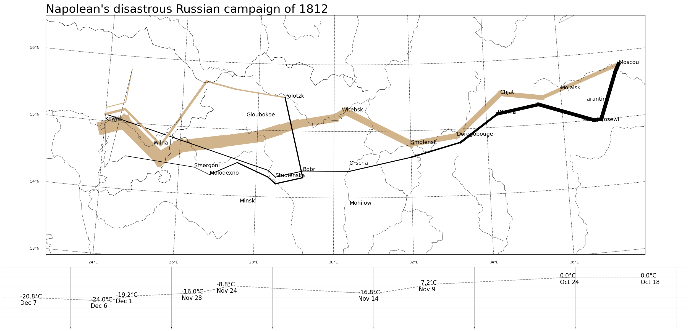

# Project 2: Napoleon's disastrous Russian campaign of 1812

## 👋 Introduction
This project reproduces the famous data visualization project, [Charles Minard's Napoleon's disastrous Russian campaign of 1812](https://en.wikipedia.org/wiki/Charles_Joseph_Minard#:~:text=Charles%20Minard's%20map%20of%20Napoleon,location%20relative%20to%20specific%20dates.)

It establishes the database using `pandas` and `sqlite3`, utilizes `matplotlib` and `basemap` for proof-of-concept, and the final visualization.

## ✨ Project Highlights

## 📖 Reproduction Guide
- Install [Miniconda](https://www.anaconda.com/docs/getting-started/miniconda/install)

- Set up your environment based on `environment.yml` using the command: `conda env creat -f environment.yml`

- Save the `minard.txt` in `data/` folder Run python `creat_minard_db.ipynb` under the environment to create `minard.db` in the `data/` folder

- Run python `plot_with-basemap.ipynb` under the environment to generate the final visualization `minard_clone.png`.

